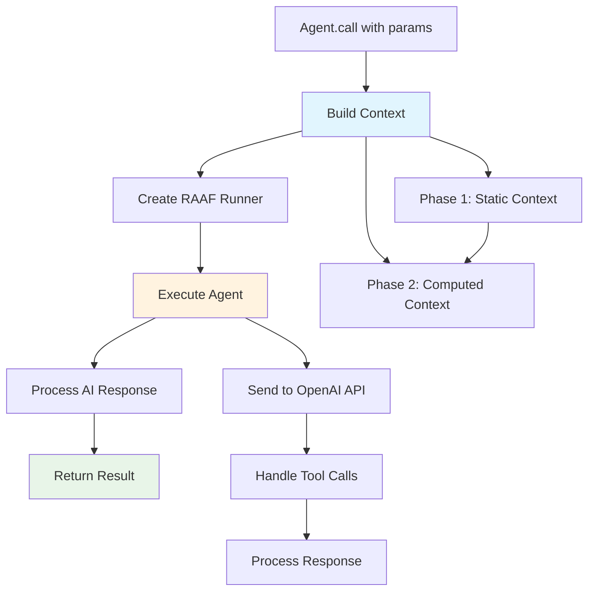
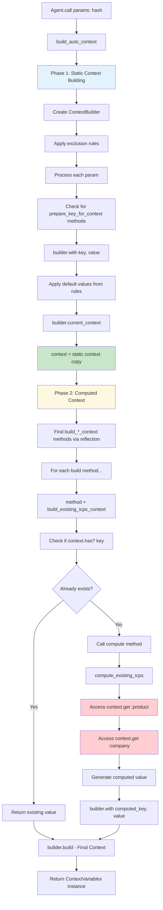
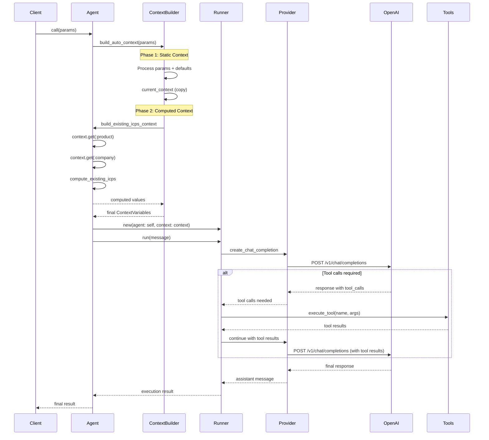
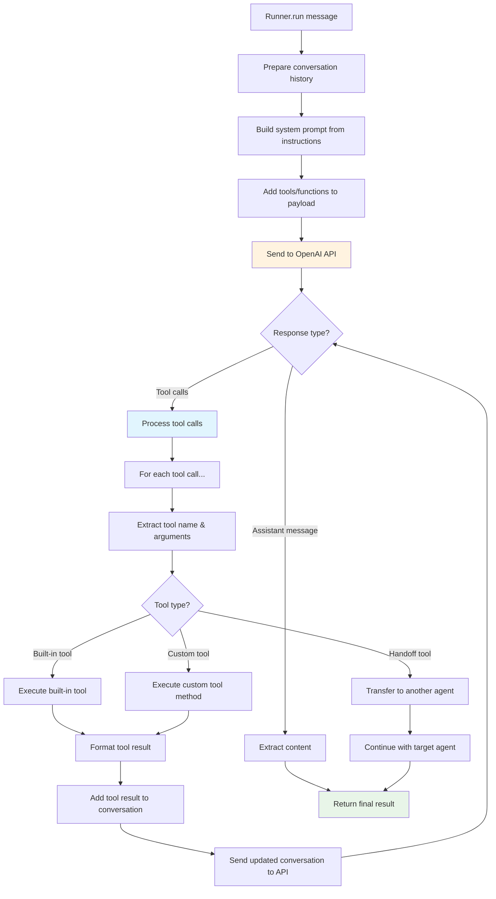
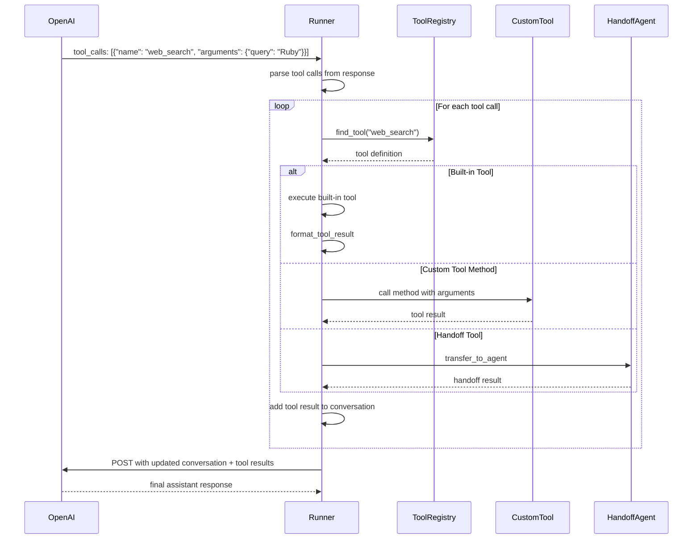
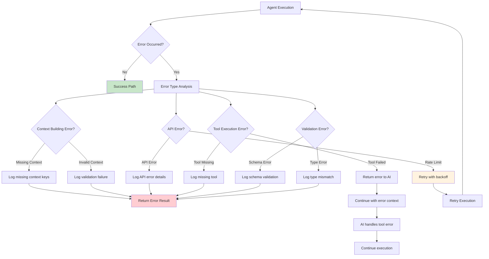
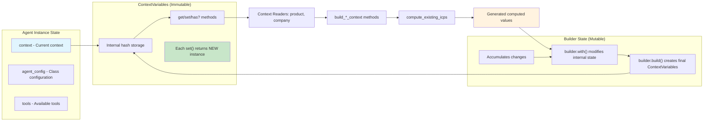

# RAAF Agent Execution Flow Documentation

This document contains comprehensive Mermaid diagrams showing the complete flow from agent call to result in the RAAF (Ruby AI Agents Factory) framework.

## 1. High-Level Agent Execution Flow

## 2. Detailed Context Building Flow

## 3. RAAF Runner Execution Flow

## 4. Context Variable Access Pattern

```mermaid
graph LR
    subgraph "Agent Instance"
        A["Agent.call"] --> B["build_auto_context"]
        B --> C["context instance variable"]
    end
    
    subgraph "ContextBuilder"
        D["ContextBuilder.new"] --> E["Internal context ContextVariables"]
        E --> F["builder.with adds to internal context"]
        F --> G["builder.current_context"]
        G --> H["Returns COPY of context"]
    end
    
    subgraph "Build Methods Access"
        I["build_existing_icps_context"] --> J["context.get :product"]
        J --> K["context.get :company"]  
        K --> L["compute_existing_icps"]
        L --> M["Generated value"]
    end
    
    B --> D
    H --> C
    C --> I
    M --> N["builder.with computed_key, value"]
    N --> O["builder.build final context"]
    
    style H fill:#c8e6c9
    style C fill:#c8e6c9
    style J fill:#ffcdd2
    style K fill:#ffcdd2
```

## 5. OpenAI API Interaction Flow

## 6. Tool Execution Detail

## 7. Error Handling and Recovery Flow

## 8. Memory and State Management

## Key Implementation Details

### Two-Phase Context Building

The most critical aspect of the RAAF context system is the **two-phase context building** approach:

1. **Phase 1: Static Context** - Parameters and defaults are processed first
2. **Phase 2: Computed Context** - `@context` is made available with static values, then computed methods can safely access them

This resolves timing issues where `build_*_context` methods couldn't access static context variables like `product` and `company`.

### Immutable Context Pattern

RAAF uses an immutable context pattern where:
- Each `ContextVariables.set()` call returns a **new instance**
- The `ContextBuilder` accumulates changes in mutable state
- `builder.current_context()` returns a **copy** for safe access
- Final `builder.build()` creates the complete immutable context

### Error Recovery Strategies

The framework includes comprehensive error handling:
- **Context errors** are logged with missing key details
- **API errors** include retry logic with exponential backoff  
- **Tool errors** are passed back to the AI for handling
- **Validation errors** provide detailed schema information

### Tool Execution Model

RAAF supports multiple tool types:
- **Built-in tools** (web search, file operations)
- **Custom tool methods** defined on the agent
- **Handoff tools** for multi-agent workflows
- **OpenAI-hosted tools** for complex operations

Each tool type follows the same execution pattern but with different resolution and execution strategies.

---

*Generated: 2025-08-15*
*Framework: RAAF (Ruby AI Agents Factory)*
*Version: Current as of commit 6bcdd3c*